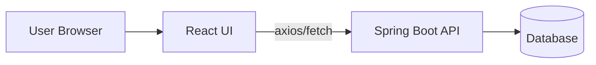
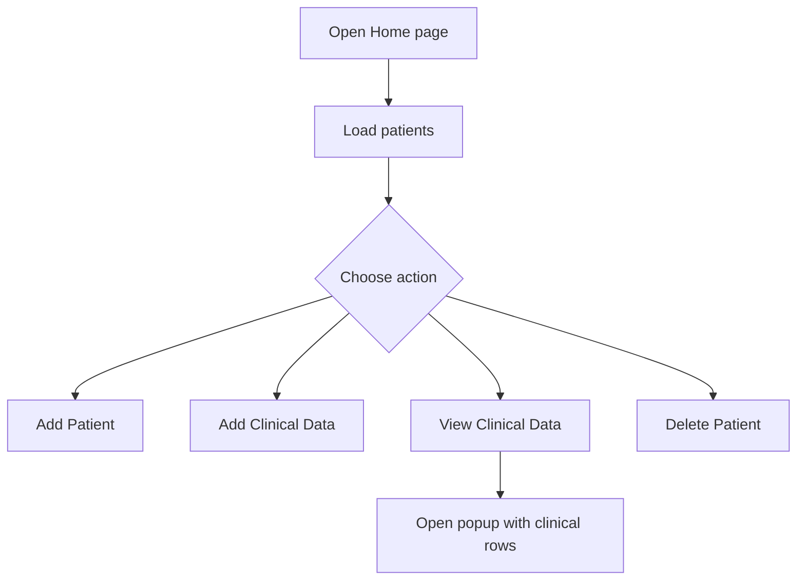

# Clinicals UI App

Simple React UI for managing patients and their clinical data.

## What this app does

- Shows a list of patients on the Home page.
- Lets you add a new patient.
- Lets you add clinical data for a selected patient.
- Lets you view clinical data in a popup table.
- Lets you delete a patient.
- Shows feedback using toast notifications.

## Pages and routes

- `/` -> Home (`Patient Details` table + actions)
- `/add-patient` -> Add Patient form
- `/add-clinicals/:patientId` -> Add Clinical Data form for one patient

## Backend API used by UI

- `GET /api/patients` -> fetch all patients
- `POST /api/patients` -> create patient
- `DELETE /api/patients/{id}` -> delete patient
- `GET /api/patients/{id}` -> fetch selected patient details
- `POST /api/clinicaldata/clinicals` -> save clinical data
- `GET /api/clinicaldata/patient/{patientId}` -> fetch clinical data for modal

Base URL in code: `http://localhost:8080`

## Quick start

```bash
npm install
npm start
```

Open: `http://localhost:3000`

## Diagrams

### 1) High-level architecture



### 2) Home page actions flow



## Main frontend files

- `src/App.js` - routes + global toast container
- `src/components/Home.js` - patient list, modal view, delete action
- `src/components/AddPatient.js` - patient creation form
- `src/components/AddClinicals.js` - clinical data form
- `src/App.css` - shared UI styles
